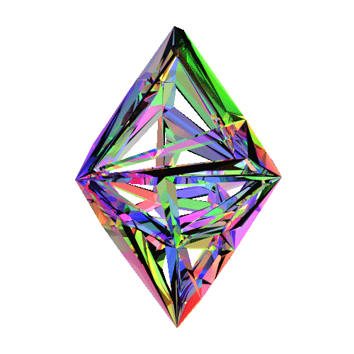
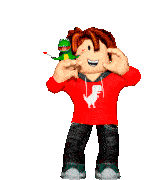
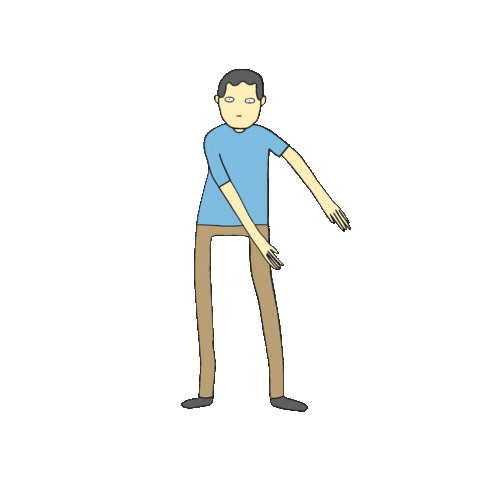
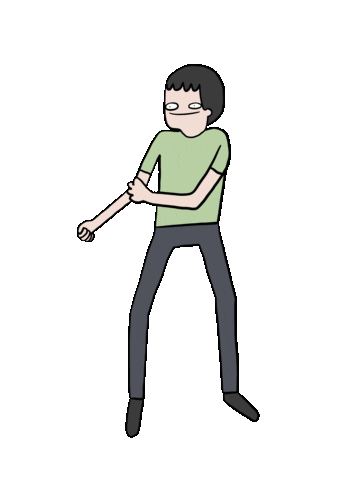
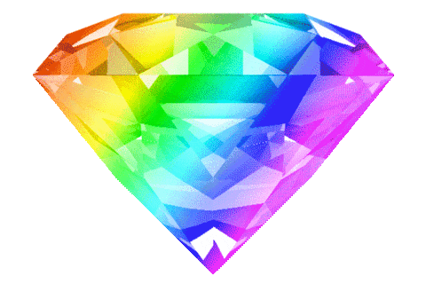
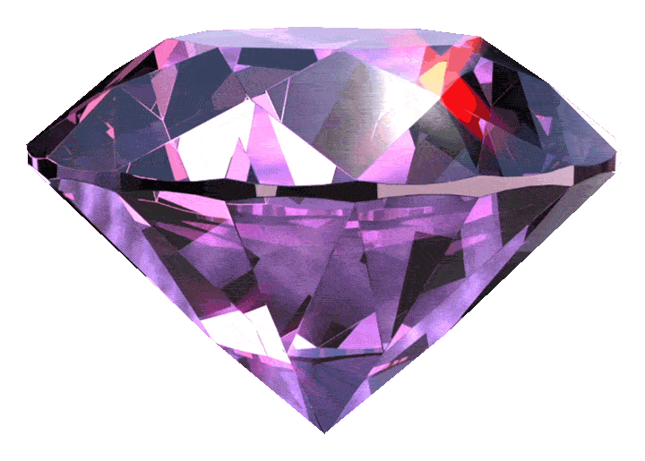
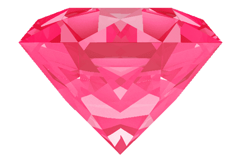
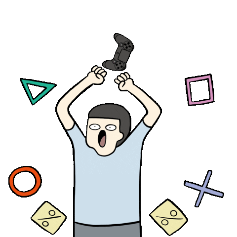
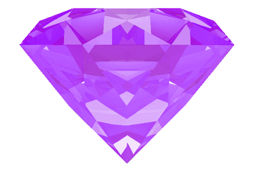
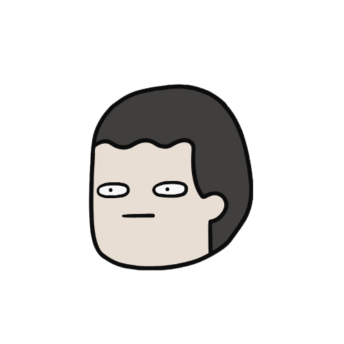

# CODE FİGHTERS PAGE

Welcome to our group website! This project showcases the collaborative efforts of our group, highlighting various tasks and projects we've worked on together. Below, you'll find links to specific tasks and their corresponding details.

https://omerfaruk2626.github.io/code_fighters/

## Table of Contents

- [About](#)

- [Contact](#)
- [Projects](#)
- <a href="https://github.com/omerfaruk2626/code_fighters/graphs/contributors">Contributing</a>
- <a href="./Code_Fighters_Log_in/login.html">Login</a>

## About

This website serves as a digital portfolio for our group, providing a central hub for our collaborative projects and tasks. It's a testament to our teamwork, creativity, and technical skills.

## Projects
<ul>
                                    <li><a href="#" class="dropdown-item" onclick="showSection('gallery')">Gallery</a>
                                    </li><a href="#" class="dropdown-item" onclick="showSection('anthony')">Anthony Harold</a></li>
                                    <li><a href="#" class="dropdown-item" onclick="showSection('guess')">Guess Game</a></li>
                                    <li><a href="#" class="dropdown-item" onclick="showSection('calculator')">Calculator</a></li>
                                    <li><a href="#" class="dropdown-item" onclick="showSection('home-furniture')">Home Furniture</a></li>
                                    <li><a href="#" class="dropdown-item" onclick="showSection('parallax')">Parallax</a></li>
                                    <li><a href="#" class="dropdown-item" onclick="showSection('leap-year-and-get-seasons')">Get Seasons</a></li>
                                    <li><a href="#" class="dropdown-item" onclick="showSection('cw-paths')">Clarusway Paths</a></li>
                                    <li><a href="#" class="dropdown-item" onclick="showSection('netflix')">Netflix</a></li>
                                    <li><a href="#" class="dropdown-item" onclick="showSection('media-quare')">Media Quare</a></li>
                                    <li><a href="#" class="dropdown-item" onclick="showSection('apple')">Apple</a></li>
                                    <li><a href="#" class="dropdown-item" onclick="showSection('grid')">Grid</a></li>
                                    <li><a href="#" class="dropdown-item" onclick="showSection('animation')">Animations</a></li>
                                    <li><a href="#" class="dropdown-item" onclick="showSection('boostrap')">Boostrap</a></li>
                                    <li><a href="#" class="dropdown-item" onclick="showSection('dom-1')">Dom-1</a></li>
                                    <li><a href="#" class="dropdown-item" onclick="showSection('random-color')">Random color</a></li>
                                    <li><a href="#" class="dropdown-item" onclick="showSection('guess-2')">Guess-2</a></li>
                                    <li><a href="#" class="dropdown-item" onclick="showSection('todolist')">To Do List</a></li>
                                    <li><a href="#" class="dropdown-item" onclick="showSection('score-keeper')">Score Keeper</a></li>
                                    <li><a href="#" class="dropdown-item" onclick="showSection('validator')">Validator</a></li>
                                    <li><a href="#" class="dropdown-item" onclick="showSection('vowels')">Vowels</a></li>
                                    <li><a href="#" class="dropdown-item" onclick="showSection('wallet')">Wallet</a></li>
                                    <li><a href="#" class="dropdown-item" onclick="showSection('sass-projects')">SASS Projects</a></li>
                            

## Contributing

If you'd like to contribute to this project, follow these steps:

1. Fork the repository
2. Create a new branch: `git checkout -b feature/new-feature`
3. Make your changes
4. Commit your changes: `git commit -m 'Add new feature'`
5. Push to the branch: `git push origin feature/new-feature`
6. Submit a pull request

## License

This project is licensed under the [MIT License](LICENSE). Feel free to use, modify, and distribute the code.

Happy coding!
